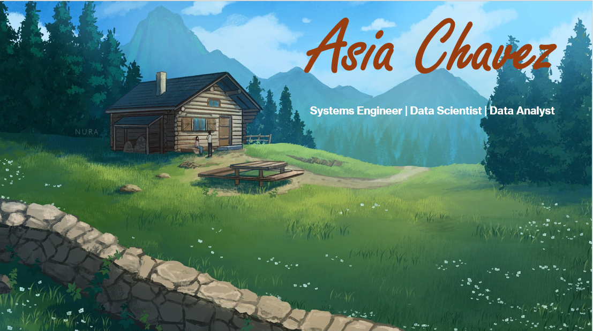

# 👋 Hi, I’m Asia

I’m a systems engineer turned aspiring data scientist, passionate about using data to uncover insights and build meaningful solutions. With several years of experience applying analytical rigor to complex systems, I’m now focused on growing my skills in **Python**, **SQL**, **Power BI**, and **machine learning** through hands-on projects.

### 🔭 Current Focus
- Developing predictive models and dashboards to tell data-driven stories  
- Exploring tools like Scikit-learn, Pandas, and Power BI  
- Expanding my portfolio of end-to-end data projects  

### 💡 What I Bring
- 8+ years of systems engineering experience in analytical problem solving  
- A structured, methodical approach to data modeling and interpretation  
- Curiosity and persistence — the same energy I bring to exploring new anime, music, and movies  

### 🎯 Goals
- Transition fully into a data-focused role  
- Continue learning through real-world data projects  
- Collaborate with others passionate about analytics and storytelling  

